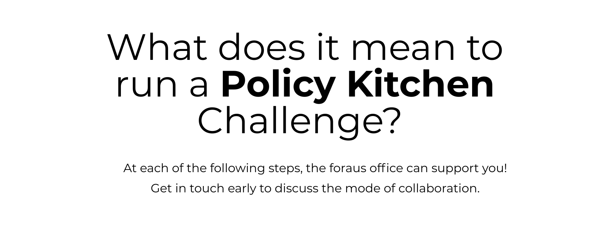
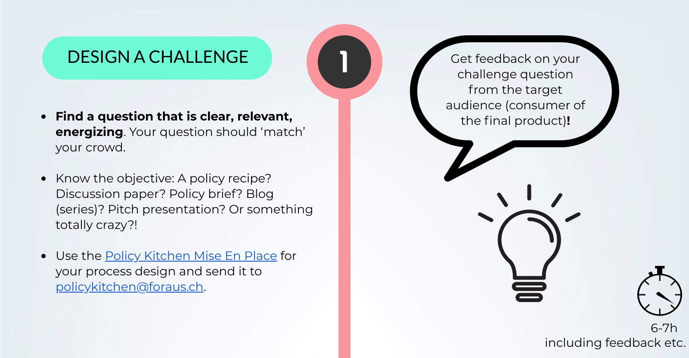
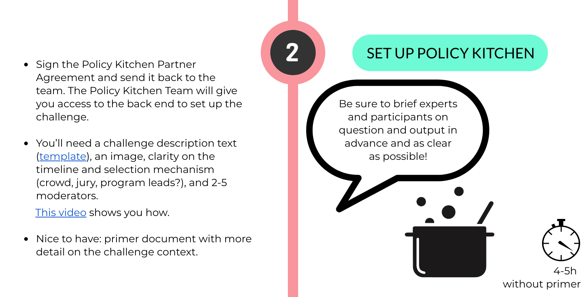
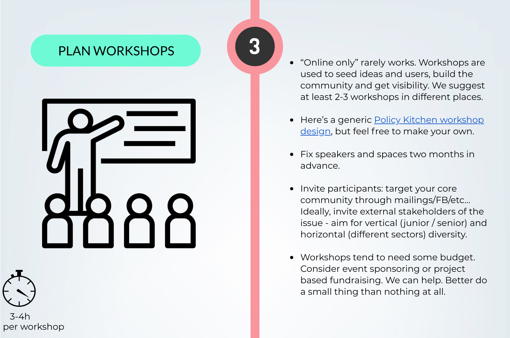
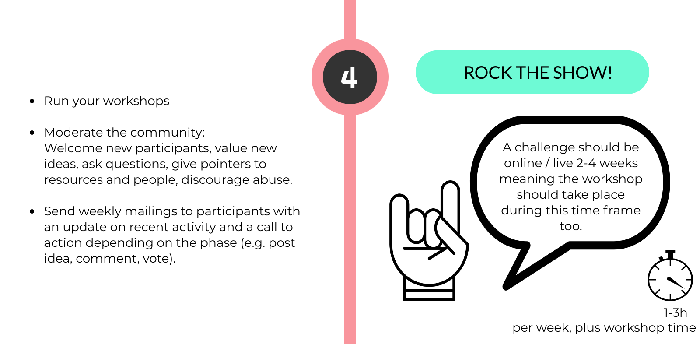
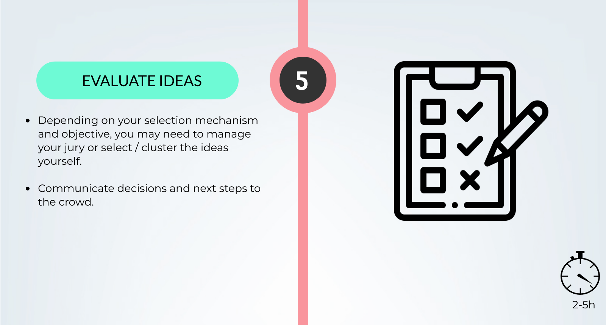
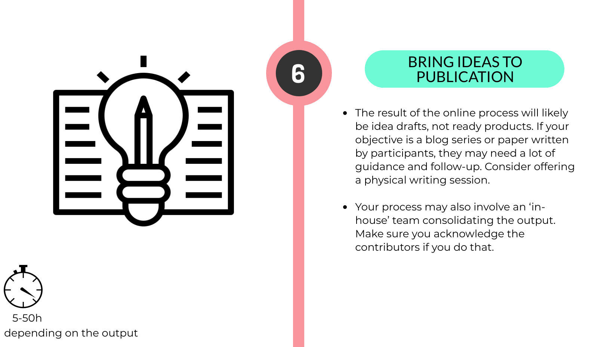
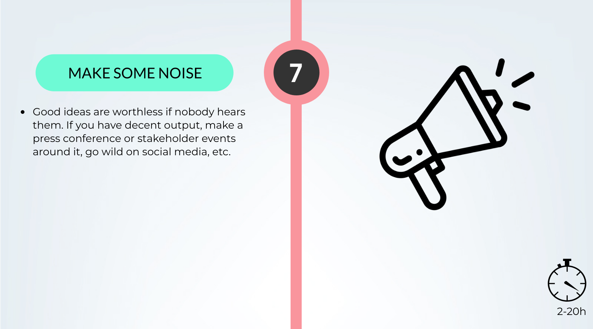

# Policy Kitchen

## What is Policy Kitchen? 

Policy Kitchen is a policy crowdsourcing method developed by foraus, using a combination of a digital innovation platform and physical workshops. It enables a diverse network of thinkers to collaboratively generate bottom-up policy recipes for pressing foreign policy challenges.  
_foraus_ secured funding over three years for improving the platform, building knowledge and scaling the community. This empowers program groups of all think tanks to run crowdsourcing campaigns - on their own, in collaboration with other think tanks, and/or with external partners.

Get a sense at [**www.policykitchen.com**](http://www.policykitchen.com)

Policy Kitchen is supported by[: Migros Pionierfonds](https://www.migros-pionierfonds.ch/de)

## **Why? - The Open Think Tank Network is more than the sum of its parts.**

When working on issues of transnational relevance, it’s silly to stay inside the national bubble. We will make better policy recommendations when drawing on a transnational network. We will also have more impact with coordinated communications to our respective governments. We are in fact experimenting with ways to make global governance more democratic. Why not?  

Learn more on the network, click [here.](../basic/describing-the-network.md) 

## **What’s in it for me?**

* You can use an advanced crowdsourcing software **to generate content, build your community, and get visibility - for free!**
* You get **support** from our experienced project **team** in running your campaign.
* We invest in developing the platform a**ccording to your needs.**
* You can use Policy Kitchen for your **fundraising** pitches - it has made it easier for us to get money, and it will make it easier for you, too.

## Highlights of Policy Kitchen 

* Pilot challenges on [**Biodiversity**](https://www.policykitchen.com/search/groups/biodiversity?type=challenge) \(autumn 2018\)

  * _7 workshops_, including in[ Berlin](https://www.policykitchen.com/node/65) in partnership with Polis180 and the Bosch Alumni Network \(first case of transnational collaboration\).
  * Rapidly _built a network_ and visibility among major stakeholders around the topic \(where we neither had networks nor expertise before\). This includes a[ Jury](https://www.policykitchen.com/group/2/about) with the state secretary on foreign affairs, members of parliament, CEO of WWF, etc...
  * _Generated 43 ideas_, some of which were handed to the Swiss Delegation at the COP-14 on biodiversity. Currently in the next phase, will lead to publication.
  * In autumn 2019, the [paper](https://www.foraus.ch/wp-content/uploads/2019/11/20191106_Policy-Kitchen-Biodiversity_WEB.pdf) "Grassroots ideas to halt biodiversity loss" was published and presented at a multi-stakeholder [event ](https://www.policykitchen.com/group/2/home/topic/biodiversity-challenge-completed-publication-out-now)in Bern.

* The challenge “[**Towards a Swiss AI Strategy**](https://www.policykitchen.com/group/11/ideas)” \(winter 2018/19\):

  * _3 workshops_ were held in Switzerland and San Francisco
  * It aimed at generating inputs for the _Swiss Federal Working Group on AI_
  * In collaboration with swissnex San Francisco and Microsoft, 68 participants representing youth, industry, policy makers, academia, and civil society _generated 38 ideas_ for the working group. A summary can be found[ here](https://www.foraus.ch/2019/02/20/switzerland-to-confirm-robot-as-cabinet-member/).
  * In autumn 2019, the [paper](https://www.foraus.ch/wp-content/uploads/2019/10/20191022_Making-Sense-of-AI_WEB-1.pdf) "Making Sense of Artificial Intelligence - Why Switzerland Should Support a Scientific UN Panel To Assess The Rise of AI" was published and presented together with another paper from a Policy Kitchen challenge in front of representatives from international organizations, the Swiss government, academia, civil society organizations and the wider public. This [event](https://www.policykitchen.com/swissaistrategy/topic/towards-ai-strategy-challenge-completed-publication-out-now) took place in Geneva. 

* The challenge “[**EU Digital Policy**](https://www.policykitchen.com/group/11/stream)” \(spring 2019\):

  * This was launched by [**Polis180**](https://polis180.org/), in collaboration with [**Ponto**](https://www.pontothinktank.org/)\*\*\*\*
  * _Several workshops_ were held in Berlin, Heidelberg and Vienna on giving young voters the opportunity to participate actively in shaping and improving the Digital Policy of the European Union
  * The 10 best demands were then selected, put together and _published_ in[ this](http://polis180.org/wp-content/uploads/2018/05/Polis-Brief-9_Brief-Format2.pdf) paper. Since then, they have been further _discussed_ with members of the European Parliament at the Polis180[ event](https://polis180.org/events/26-sep-fuer-eine-gerechtere-zukunftsorientierte-digitalpolitik-in-europa-vorstellung-forderungskatalog-der-policy-kitchen-digitalisierung/) on 26th September 2019 in Berlin.

* The challenge on “[**Towards an AI strategy for Switzerland**](https://www.policykitchen.com/group/towards-inclusive-future-ai/about)” \(spring 2019\):
  * _2 workshops_ in[ **Zurich**](https://www.youtube.com/watch?v=Jlow-HpojLo&feature=youtu.be) and[ **San Francisco**](https://www.policykitchen.com/node/122) in partnership with Swissnex. Participants included governments, academia, NPO, UN, industry \(also Google & Microsoft\), civil society & youth
  * More than _40 new users_ and more than _20 ideas_ in 1 week.
  * Ideas have been submitted to the working group on AI of the _Swiss government_.
  * The resulting [paper](https://www.foraus.ch/wp-content/uploads/2019/10/20191022_Policy-Kitchen-AI_WEB-2.pdf) "Towards an Inclusive Future in AI - A Global Participatory Process" was published in autumn 2019 and subsequently presented at a multi-stakeholder [event](https://www.policykitchen.com/group/19/stream), together with the paper on a Swiss AI strategy, in Geneva.  
* Further challenges led by members of the[ **Open Think Tank Network**](https://www.openthinktank.org/about-us/) include[ **Swiss China policy**](https://www.policykitchen.com/group/switzerlands-economic-interests-china/about),[ **EU cultural policy**](https://www.policykitchen.com/group/16/home),[ **UK migration policy**](https://www.policykitchen.com/group/towards-fairer-uk-immigration-system) and more.

If you want to know how to create a challenge on the platform of Policy Kitchen, take a look at this video.



## **Policy Kitchen Workshop Design Template**



**Duration:** 4 Hours

**Participants:** About _**10 - 40 people**_. We strongly encourage you to ensure diversity, both horizontally \(interdisciplinary, multiple sectors\) and vertically \(mixing senior and junior\).  
****

**Roles:** One person can have multiple roles \(e.g. host, facilitator, representative\), but the roles are distinct and you can empower more people by giving them representative or facilitator roles.

* _**A Host**_ - hosts the entire workshop
* _**Facilitators**_ - hosts a group session on a topic \(~ participants / 10 = facilitators\)
* _**Expert\(s\)**_ - provides brief challenge \(“this is the problem, help us solve it”\), provides advice and feedback to groups, supports group sessions with know-hows, and presents for questions.
* _**Helper\(s\) -**_ for organizational reasons 
* _**Representative of the organiser**_
* _**Representative of the partner**_
* _**Documentation \(**photo & video\) **-**_ a person who documents the workshop

**Requirements:**

* Inspiring space for whole plenary
* Walls/ Whiteboard with standing space for 10 \(as many such walls as facilitators\)
* WiFi, password visible in all relevant places.
* Beamer
* Name tags \(optional\)
* Post-its
* Paper cards \(post-its can also do the job\)
* Pens for all
* Each participant should bring a laptop
* Catering \(drinks/snacks throughout, after-workshop beer\)

**Notes:**

* This format can be cut to 3 hours or extended to 2 days. Talk to us to know how.
* This format doesn’t end with a flurry of useless post-its, but actual, public, output.
* You need to know and communicate where the journey is going, and why you are doing this.
* Policy Kitchen allows you to combine outputs of multiple workshops \(and remote contributions\) in one place.

**Questions?** [Contact Policy Kitchen ](policy-kitchen.md#contact-us)

### A Schedule Template 

<table>
  <thead>
    <tr>
      <th style="text-align:left"><b>Time</b>
      </th>
      <th style="text-align:left"><b>Activity</b>
      </th>
      <th style="text-align:left"><b>Format</b>
      </th>
      <th style="text-align:left"><b>Lead</b>
      </th>
    </tr>
  </thead>
  <tbody>
    <tr>
      <td style="text-align:left">17:00</td>
      <td style="text-align:left">
        
<b>Arrival</b>
        

        
(Optional: register / name tags)

      </td>
      <td style="text-align:left">Casual</td>
      <td style="text-align:left">Helper</td>
    </tr>
    <tr>
      <td style="text-align:left">17:15</td>
      <td style="text-align:left">
        
<b>Welcome message</b>
        

        
Why are we here? What will we do?

      </td>
      <td style="text-align:left">Plenary, seated in half-circles with view to screen &amp; presenter.</td>
      <td
      style="text-align:left">Host</td>
    </tr>
    <tr>
      <td style="text-align:left">17:20</td>
      <td style="text-align:left">
        
<b>Who&#x2019;s in the room?</b>
        

        
(Brief if many, deeper/playful if few)

      </td>
      <td style="text-align:left">Host</td>
      <td style="text-align:left"></td>
    </tr>
    <tr>
      <td style="text-align:left">17:40</td>
      <td style="text-align:left"><b>Intro: Organiser / Policy Kitchen</b>
      </td>
      <td style="text-align:left">Representative of organiser</td>
      <td style="text-align:left"></td>
    </tr>
    <tr>
      <td style="text-align:left">17:47</td>
      <td style="text-align:left"><b>Message from Partner</b>
      </td>
      <td style="text-align:left">Partner representative</td>
      <td style="text-align:left"></td>
    </tr>
    <tr>
      <td style="text-align:left">17:50</td>
      <td style="text-align:left">
        
<b>Input</b>
        

        
Context and most important questions about the challenge

      </td>
      <td style="text-align:left">Expert</td>
      <td style="text-align:left"></td>
    </tr>
    <tr>
      <td style="text-align:left">18:00</td>
      <td style="text-align:left">
        
<b>Issue mapping</b>
        

        
What are the most pressing challenges?

        <ul>
          <li><em>8 mins:</em> Divide plenary in as many groups as there are facilitators
            / walls, according to interest in different aspects of challenge.</li>
          <li><em>7 mins:</em> silent on post-its.</li>
          <li><em>30 mins:</em> one by one, present issue to plenary, stick to wall.
            Build clusters organically. Stick duplicates onto clusters without comment.</li>
        </ul>
      </td>
      <td style="text-align:left">Groups of ~10, standing at wall or large whiteboard
         
         
      </td>
      <td style="text-align:left">Facilitators</td>
    </tr>
    <tr>
      <td style="text-align:left">18:45</td>
      <td style="text-align:left"><b>Groups form</b> around issues according to interest. Use &#x2018;3 dots
        each&#x2019; to figure out interest is and who&#x2019;s in which group.</td>
      <td
      style="text-align:left">Facilitators</td>
        <td style="text-align:left"></td>
    </tr>
    <tr>
      <td style="text-align:left">19:00</td>
      <td style="text-align:left"><b>Break</b> with snacks</td>
      <td style="text-align:left">Casual</td>
      <td style="text-align:left">Helper</td>
    </tr>
    <tr>
      <td style="text-align:left">19:15</td>
      <td style="text-align:left">
        
<b>Policy Kitchen On-boarding</b>
        

        
Show on-screen how to create an account, post an idea and add co-authors.
          Make sure everyone got an account.

      </td>
      <td style="text-align:left">Plenary</td>
      <td style="text-align:left">Host</td>
    </tr>
    <tr>
      <td style="text-align:left">19:20</td>
      <td style="text-align:left">
        
<b>Ideation</b>
        

        <ul>
          <li><em>Silently:</em> production of many! ideas on paper cards (7 min)</li>
          <li><em>Without discussion:</em> cluster ideas (10 min)</li>
          <li>Choose 1 idea to work on (10 min)</li>
          <li>Upload rough draft on platform as co-authors (20 min)</li>
        </ul>
      </td>
      <td style="text-align:left">Groups of 2 (or 3)</td>
      <td style="text-align:left">Facilitators</td>
    </tr>
    <tr>
      <td style="text-align:left">20:10</td>
      <td style="text-align:left">
        
<b>Pitch</b>
        

        
Each group presents what they have been working on. Allow discussion if
          time permits.

      </td>
      <td style="text-align:left">
        
Plenary

        
(ideally seated in circle)

      </td>
      <td style="text-align:left">Host</td>
    </tr>
    <tr>
      <td style="text-align:left">20:50</td>
      <td style="text-align:left"><b>Ending / thank you&#x2019;s</b>
      </td>
      <td style="text-align:left">Host</td>
      <td style="text-align:left"></td>
    </tr>
    <tr>
      <td style="text-align:left">21:00</td>
      <td style="text-align:left">
        
<b>Drinks &amp; Beer</b>
        

        
This informal space is as important as all the rest above. Make sure you
          can keep the room for a while.

      </td>
      <td style="text-align:left">Casual</td>
      <td style="text-align:left"></td>
    </tr>
  </tbody>
</table>## **How about the fundraising part?**

Policy Kitchen makes it easier for you to raise funds using a narrative along these lines:

_“Look, we bring all this value and innovativeness to the table: a glitzy Policy Kitchen platform, a kick-ass international community of thinkers, loads of experience running participatory bottom up processes. Here are some of our previous successes \(list\)._

_Now all we need is a little support to run campaign X \(or more\). A little project management, some money to unlock workshops, publications and impact events \(and a modest overhead\). All the rest we already bring with us. This stuff is gonna shape the future and your name will be associated with it.”_

You can now _**use that same narrative**_ referring to Policy Kitchen when you do your fundraising. We would appreciate it if a fraction of the money also went to improving policy kitchen, but at this stage it’s more important that your projects fly.

## **Contact Information**

**Project Lead:** Eduardo Belinchón

[eduardo.belinchion@foraus.ch](mailto:eduardo.belinchon@foraus.ch) 

**Generic:**  [policykitchen@foraus.ch](mailto:policykitchen@foraus.ch)  
  

  

  
  
****

